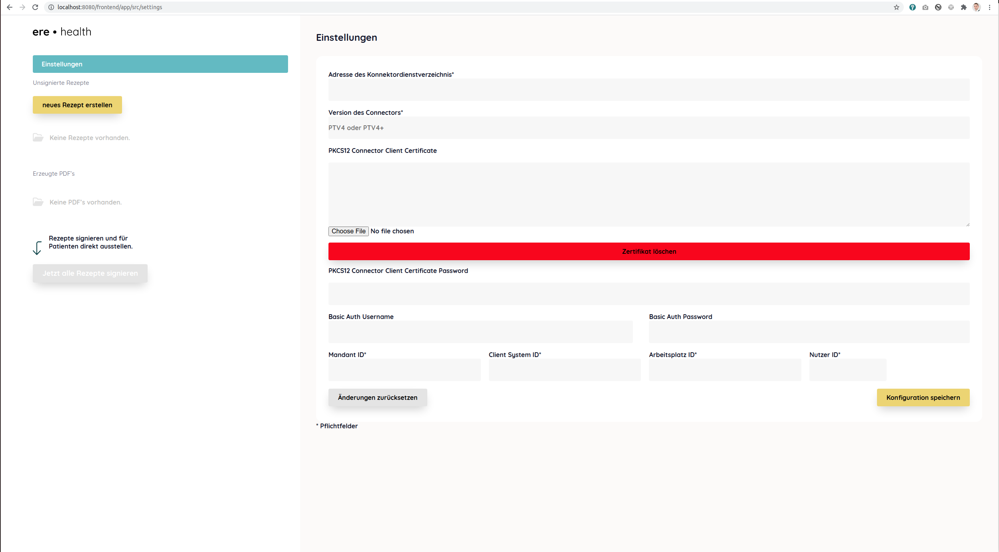
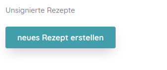
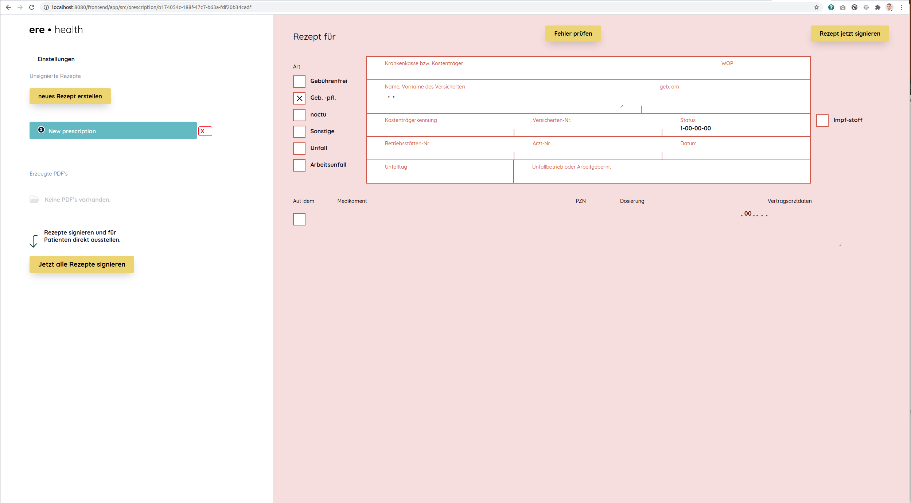
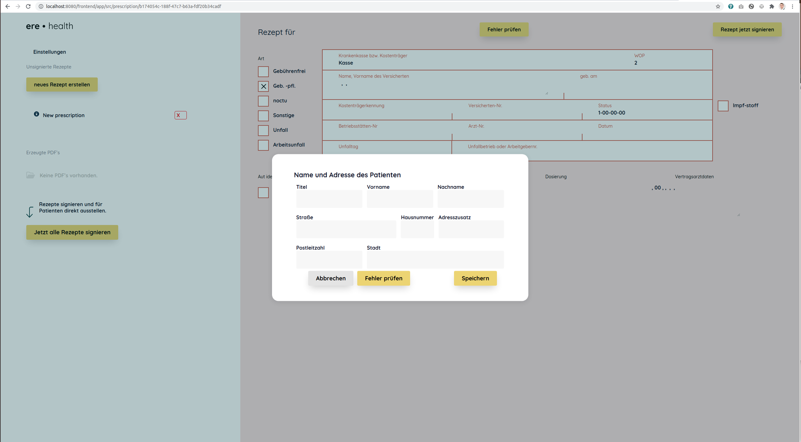
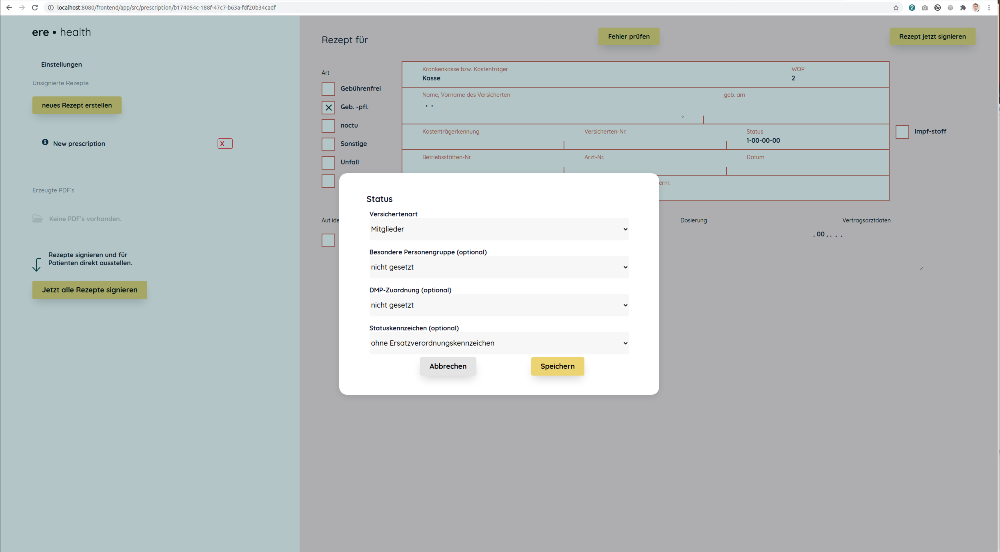
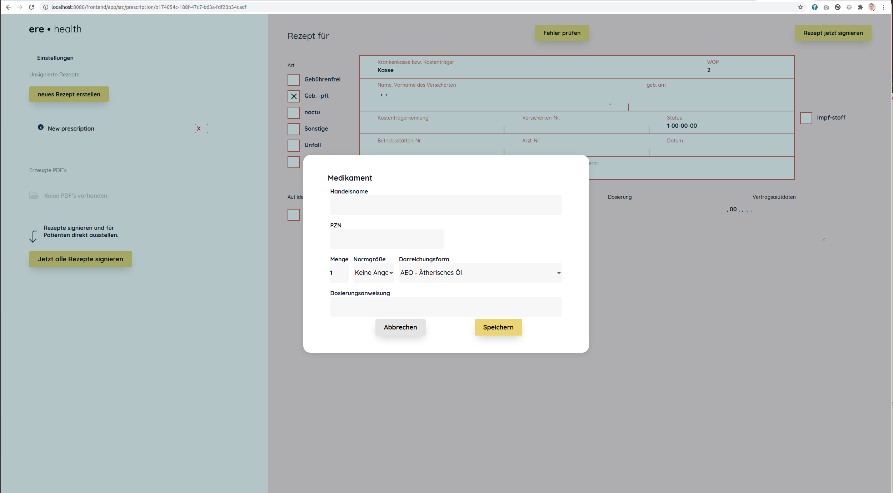
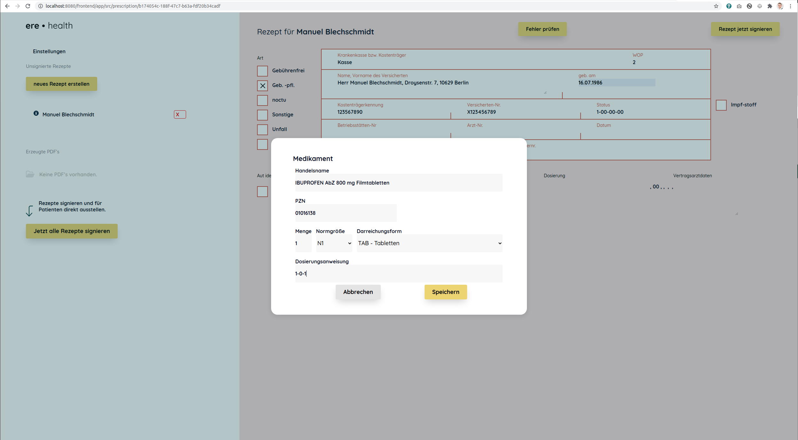
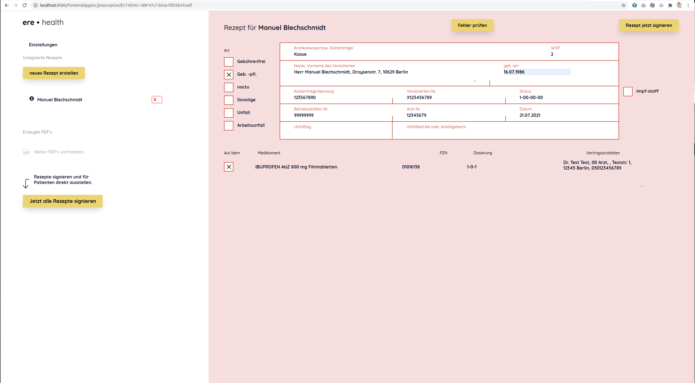
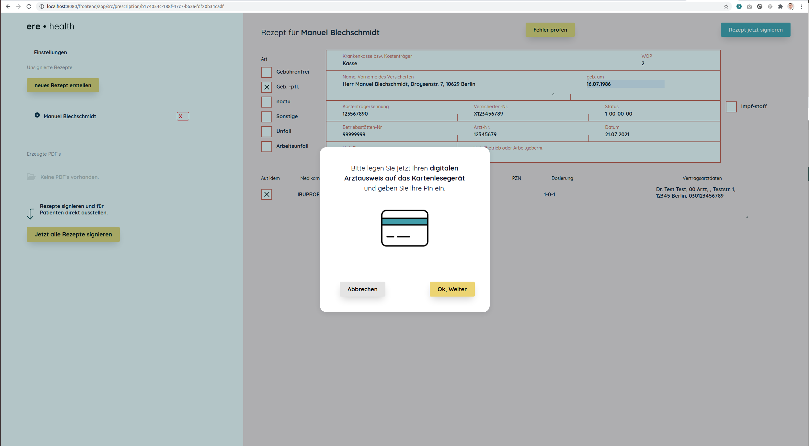

# Einstellungen und Standalone Rezept erstellen

Als Arzt müssen Sie beim Erstellen von Rezepten verschiedene Gesetze beachten z.B. [SGB 5 §27 ff.](https://www.gesetze-im-internet.de/sgb_5/index.html) und [AVWG](https://www.buzer.de/s1.htm?g=Arzneimittelversorgungs-Wirtschaftlichkeitsgesetz&f=1). Bitte informieren Sie sich seperat darüber.

Nach der Installation können Sie folgende URL im Browser aufrufen: http://localhost:8080/frontend/app/src/index.html

Klicken Sie auf Einstellungen. Füllen Sie die Felder mit den Einstellungen aus Ihren Connector z.B. KocoBox oder Secunet.

Falls die Konfiguration korrekt ist, können Sie nun eine E-Rezept erstellen. 

Gehen Sie nach und nach die Felder durch z.B. füllen Sie die Patientendaten aus.

Teilweise müssen Sie auf den kleinen Stift klicken, der auftaucht, wenn Sie mit der Maus über einen Bereich schweben. Füllen Sie hier den Status aus.

Füllen Sie hier das zu verschreibende Medikament aus.

Hier z.B. Ibuprofen 800 mg Filmtabletten.

Weiterhin müssen Sie Ihre Arztdaten eingeben.

Nun können Sie auf Rezept jetzt signieren drücken.

Folgenden Sie danach den Anweisungen auf dem Bildschirm.

